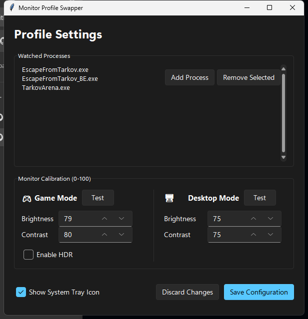

# Monitor Profile Swapper


**Automate your monitor's brightness, contrast, and HDR settings based on the game you're playing.**

Monitor Profile Swapper is a lightweight utility that automatically switches your monitor's display settings when specific applications (like games) are launched. When you close the game, it instantly reverts to your desktop preferences.

Perfect for games like *Escape from Tarkov* where higher visibility is crucial, without blinding yourself on your desktop.

---

## 📸 Preview

**Modern Windows 11 GUI**


---

## ✨ Features

*   **Automatic Detection**: Watches for specific process names (e.g., `EscapeFromTarkov.exe`).
*   **Dual Profiles**:
    *   **Game Mode**: Boost brightness/contrast and optionally enable **HDR** for a competitive advantage.
    *   **Desktop Mode**: Comfortable settings for browsing and work. matched to your system theme.
*   **HDR Toggling**: Automatically enables Windows HDR when entering game mode and disables it on exit.
*   **System Tray Control**: Background monitoring with a handy tray icon for quick access to settings and manual update checks.
*   **Auto-Updating**: Stay up to date automatically. The app checks for new versions on launch and can be updated with a single click.
*   **DDC/CI Support**: Communicates directly with your monitor hardware.
*   **Portable**: Runs as a standalone executable (no installation required).

---

## 🚀 Installation & Usage

### Option 1: Download the Release
1.  Download the latest `.zip` from the [Releases](../../releases) page.
2.  Extract the folder to a location like `Documents\MonitorSwapper`.
3.  Run `MonitorSwapper.exe`.

### Option 2: Build from Source
```bash
git clone https://github.com/dlanz1/monitor-profile-swapper.git
cd monitor-profile-swapper
pip install -r requirements.txt
python build.py
```

---

## 🎮 How to Use

1.  **Configure Settings**:
    Click the tray icon or run `Settings.exe`.
    *   **Watched Processes**: Add the executable names of the games you want to detect.
    *   **Monitor Calibration**: Set Brightness and Contrast (0-100).
    *   **HDR**: Check "Enable HDR" if you want the tool to toggle Windows HDR for you.
    *   Click **Save Configuration**.

2.  **Background Monitoring**:
    *   `MonitorSwapper.exe` runs silently in your system tray.
    *   Right-click the icon to manually **Check for updates** or exit the app.
    *   When a game is detected, your monitor settings will update visibly.

---

## 🖥️ Hardware Compatibility

This tool relies on the **DDC/CI** standard to communicate with your display.

*   ✅ **Supported**: Most modern external PC monitors (connected via DisplayPort, HDMI, or DVI).
*   ❌ **Likely Unsupported**:
    *   **Laptop Screens**: Internal displays usually use different control methods.
    *   **TVs**: Many televisions do not support DDC/CI over HDMI.
    *   **DisplayLink Docks**: Some USB docking stations may block DDC/CI signals.

---

## 📄 License

Distributed under the MIT License. See `LICENSE` for more information.